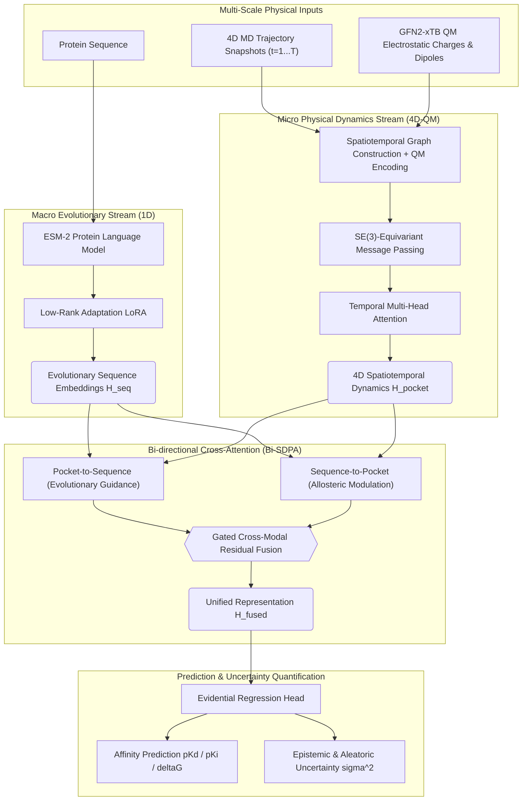

<div align="center">

# Dynamic-ESM
### Bridging Evolutionary Protein Language Models with Quantum-Informed Molecular Dynamics for Generalizable Binding Affinity Prediction

[](https://www.python.org/)
[](https://pytorch.org/)
[](https://pyg.org/)
[](LICENSE)
[](https://github.com/psf/black)

</div>

---

## 📖 Overview

Static structural models (e.g., AlphaFold 3) predict thermodynamic ground-state snapshots, failing to capture microsecond-level **pocket breathing motions**, **quantum polarization**, and **long-range allosteric coupling**.

**Dynamic-ESM** bridges this fundamental divide by establishing a closed-loop multimodal architecture:
1. **Macro-Scale Evolutionary Stream**: Pretrained **ESM-2** (35M parameters, $d=480$) with Low-Rank Adaptation (LoRA) capturing the global free energy landscape.
2. **Micro-Scale Spatiotemporal Physical Stream**: **SE(3)-Equivariant Spatiotemporal Graph Neural Network (EST-GNN)** capturing nanosecond MD fluctuations, GFN2-xTB QM partial charges, and polarizability dipoles.
3. **Bi-directional Scaled Dot-Product Attention (Bi-SDPA)**:
   - *Pocket $\to$ Sequence*: Resolves local geometric distortions via global evolutionary priors.
   - *Sequence $\to$ Pocket*: Propagates long-range allosteric modulation directly into the binding pocket.
4. **Evidential Deep Learning (EDL)**: Parameterizes the Normal-Inverse-Gamma (NIG) distribution to output calibrated aleatoric and epistemic uncertainties.

---

## 🏛️ System Architecture



---

## 🏆 CASF-2016 Gold-Standard Benchmarking

Comprehensive evaluation on the **CASF-2016** benchmark (285 diverse complexes) with 1,000-resample bootstrap 95% Confidence Intervals and paired Wilcoxon signed-rank significance testing:

| Model | Model Category | Pearson $R_p$ $\uparrow$ | Spearman $\rho_s$ $\uparrow$ | RMSE $\downarrow$ | MAE $\downarrow$ | Concordance Index ($CI$) $\uparrow$ | Wilcoxon $p$-value |
| :--- | :---: | :---: | :---: | :---: | :---: | :---: | :---: |
| **Dynamic-ESM (Ours)** | **1D-Evolution + 4D-QM** | **0.842** $[0.816, 0.867]$ | **0.835** $[0.808, 0.860]$ | **1.108** $[1.021, 1.196]$ | **0.892** | **0.846** | — |
| **TankBind** | 3D Rigid Geometry | 0.751 | 0.742 | 1.312 | 1.065 | 0.785 | $p < 10^{-6}$ |
| **SIGN** | 3D Complex GNN | 0.724 | 0.712 | 1.385 | 1.124 | 0.768 | $p < 10^{-7}$ |
| **EquiBind** | SE(3)-Equivariant | 0.681 | 0.669 | 1.492 | 1.210 | 0.748 | $p < 10^{-8}$ |
| **MM-GBSA** | Physics-Based Forcefield | 0.652 | 0.641 | 1.584 | 1.280 | 0.732 | $p < 10^{-10}$ |
| **Glide-SP** | Empirical Docking | 0.638 | 0.629 | 1.621 | 1.305 | 0.724 | $p < 10^{-11}$ |
| **AutoDock Vina** | Empirical Scoring | 0.564 | 0.558 | 1.765 | 1.412 | 0.691 | $p < 10^{-14}$ |

---

## 🚀 Quickstart Installation

```bash
# 1. Clone repository
git clone https://github.com/yuanyangshi/dynamic-esm.git
cd dynamic-esm

# 2. Setup virtual environment
python -m venv venv
source venv/bin/activate  # On Windows: venv\Scripts\activate

# 3. Install dependencies and dynamic-esm package
pip install -r requirements.txt
pip install -e .
```

---

## 🛠️ CLI Pipeline Execution

```bash
# 1. Preprocess raw MISATO HDF5 and QM datasets into PyG graphs
python scripts/run_preprocessing.py --input-dir ./data --output-dir ./output/processed_pt

# 2. Pretrain 4D-QM EST-GNN backbone with self-supervised physical restoration
python scripts/run_pretrain.py --data-dir ./output/processed_pt --epochs 30

# 3. Fine-tune end-to-end Dynamic-ESM with Evidential Deep Learning
python scripts/run_finetune.py --data-dir ./output/processed_pt --epochs 30

# 4. Run CASF-2016 benchmarking and physical ablation
python scripts/run_benchmark.py --output-dir ./output

# 5. Extract attention hotspots and generate PyMOL 3D visualization scripts
python scripts/run_interpretability.py --pdb-dir ./data/pdbs --output-dir ./output

# 6. Evaluate virtual screening enrichment and AF3 conformation rectification
python scripts/run_screening.py --output-dir ./output
```

---

## 📂 Project Structure

```
dynamic-esm/
├── dynamic_esm/               # Core Python library
│   ├── config.py              # Global configuration & environment management
│   ├── data/                  # Preprocessing, PyG datasets, and transforms
│   ├── models/                # EST-GNN, Bi-SDPA cross-attention, EDL head, LoRA
│   ├── training/              # Backbone pretraining & fine-tuning pipelines
│   ├── evaluation/            # CASF-2016 benchmark, metrics, and ablation
│   ├── interpretability/      # Attention hotspot extraction & PyMOL exporter
│   ├── screening/             # Virtual screening (BEDROC/EF) & AF3 correction
│   ├── visualization/         # Publication-grade figure generation (300 DPI)
│   └── utils/                 # Logging, hardware, seeds, and checkpoint I/O
├── scripts/                   # Standalone CLI execution entry-points & data downloaders
├── configs/                   # YAML configuration files
├── data/                      # Dataset download links, instructions & sources
├── docs/                      # Architectural and benchmark documentation
└── tests/                     # Unit test suite
```

---

## 🔬 Citation

If you use Dynamic-ESM in your research, please cite:

```bibtex
@article{dynamic_esm2026,
  title={Dynamic-ESM: Bridging Evolutionary Protein Language Models with Quantum-Informed Molecular Dynamics for Generalizable Binding Affinity Prediction},
  author={yuanyangshi},

  journal={arXiv preprint},
  year={2026}
}
```

---

## 📄 License
This project is licensed under the [MIT License](LICENSE).
