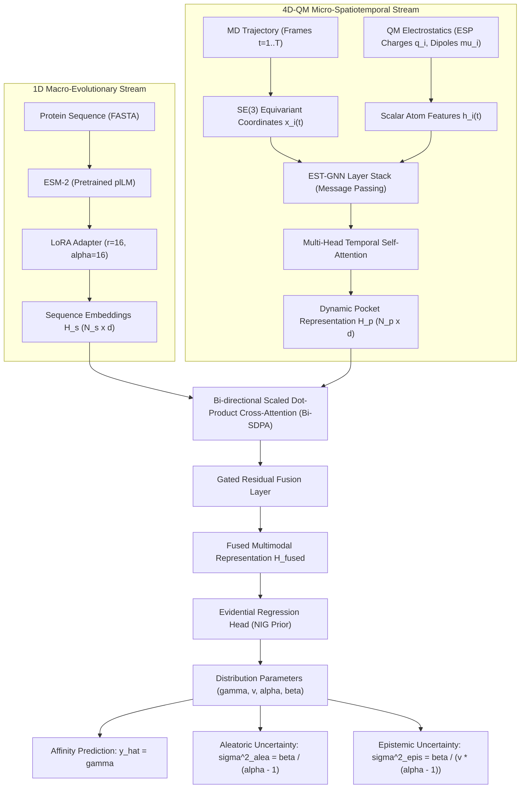

# Dynamic-ESM: Theoretical Formulation & Model Architecture

Dynamic-ESM bridges **1D macro-scale evolutionary protein language models (ESM-2)** with **4D-QM micro-scale quantum-informed spatiotemporal molecular dynamics (EST-GNN)** through a bi-directional cross-attention mechanism and Evidential Deep Learning (EDL).

---

## 1. System Overview

Static structural models (e.g., AlphaFold 3) predict thermodynamic ground-state snapshots, failing to capture:
1. **Conformational heterogeneity & breathing motions** of flexible binding pockets.
2. **Quantum electrostatic polarization and charge redistribution** upon ligand binding.
3. **Long-range allosteric coupling** between pocket dynamics and global evolutionary constraints.

Dynamic-ESM establishes a closed-loop architecture:
- **Macro-scale 1D Evolutionary Stream**: Pretrained ESM-2 with Low-Rank Adaptation (LoRA).
- **Micro-scale 4D-QM Spatiotemporal Stream**: SE(3)-equivariant Graph Neural Network (EST-GNN) capturing nanosecond MD fluctuations and QM electrostatics.
- **Bi-directional Scaled Dot-Product Cross-Attention (Bi-SDPA)**:
  - *Forward (Pocket $\rightarrow$ Sequence)*: Pocket queries evolutionary constraints.
  - *Reverse (Sequence $\rightarrow$ Pocket)*: Sequence models long-range allosteric modulation.
- **Evidential Deep Learning (EDL)**: Parameterizes predictive distributions via a Normal-Inverse-Gamma (NIG) prior, disentangling aleatoric and epistemic uncertainty.

---

## 2. Mathematical Formulations

### 2.1 SE(3)-Equivariant Spatiotemporal GNN (EST-GNN)
For atom $i$ at frame $t \in \{1, \dots, T\}$ with coordinates $\mathbf{x}_i^{(t)} \in \mathbb{R}^3$ and scalar features $\mathbf{h}_i^{(t)} \in \mathbb{R}^d$:

$$\mathbf{m}_{ij}^{(t)} = \phi_m \left( \mathbf{h}_i^{(t)}, \mathbf{h}_j^{(t)}, \mathbf{e}_{ij}^{(t)} \right)$$

$$\mathbf{x}_i^{(t), (l+1)} = \mathbf{x}_i^{(t), (l)} + \sum_{j \in \mathcal{N}(i)} \frac{\mathbf{x}_i^{(t)} - \mathbf{x}_j^{(t)}}{\|\mathbf{x}_i^{(t)} - \mathbf{x}_j^{(t)}\| + \epsilon} \cdot \phi_x \left( \mathbf{m}_{ij}^{(t)} \right)$$

$$\mathbf{h}_i^{(t), (l+1)} = \text{LayerNorm} \left( \mathbf{h}_i^{(t), (l)} + \phi_h \left( \mathbf{h}_i^{(t), (l)}, \sum_{j \in \mathcal{N}(i)} \mathbf{m}_{ij}^{(t)} \right) \right)$$

Temporal aggregation across the $T$ MD frames is performed via Multi-Head Temporal Self-Attention:

$$\mathbf{h}_i^{\text{dynamic}} = \text{TemporalAttention} \left( [\mathbf{h}_i^{(1)}, \dots, \mathbf{h}_i^{(T)}] \right)$$

### 2.2 Bi-directional Cross-Attention (Bi-SDPA)
Let $\mathbf{H}_p \in \mathbb{R}^{N_p \times d}$ be the pocket representation and $\mathbf{H}_s \in \mathbb{R}^{N_s \times d}$ be the ESM-2 sequence representation:

$$\mathbf{A}_{p \to s} = \text{softmax} \left( \frac{\mathbf{Q}_p \mathbf{K}_s^T}{\sqrt{d}} \right) \mathbf{V}_s$$

$$\mathbf{A}_{s \to p} = \text{softmax} \left( \frac{\mathbf{Q}_s \mathbf{K}_p^T}{\sqrt{d}} \right) \mathbf{V}_p$$

The multimodal representation is unified via gated residual fusion:

$$\mathbf{g} = \sigma \left( \mathbf{W}_g [\mathbf{A}_{p \to s} \,\|\, \mathbf{A}_{s \to p}] \right)$$
$$\mathbf{H}_{\text{fused}} = \mathbf{g} \odot \mathbf{A}_{p \to s} + (1 - \mathbf{g}) \odot \mathbf{A}_{s \to p}$$

### 2.3 Evidential Deep Learning (NIG Prior)
The model outputs parameters of a Normal-Inverse-Gamma distribution $\mathcal{N}\text{-}\Gamma^{-1}(\gamma, v, \alpha, \beta)$:
- **Mean prediction**: $\gamma$
- **Total uncertainty**: $\sigma^2_{\text{total}} = \sigma^2_{\text{aleatoric}} + \sigma^2_{\text{epistemic}}$
  - $\sigma^2_{\text{aleatoric}} = \frac{\beta}{\alpha - 1}$
  - $\sigma^2_{\text{epistemic}} = \frac{\beta}{v(\alpha - 1)}$

The objective function combines Student-$t$ Negative Log-Likelihood, evidence regularization, and pairwise ranking loss:

$$\mathcal{L}_{\text{total}} = \mathcal{L}_{\text{NLL}} + \lambda_{\text{reg}} \mathcal{L}_{\text{reg}} + \lambda_{\text{rank}} \mathcal{L}_{\text{rank}}$$
